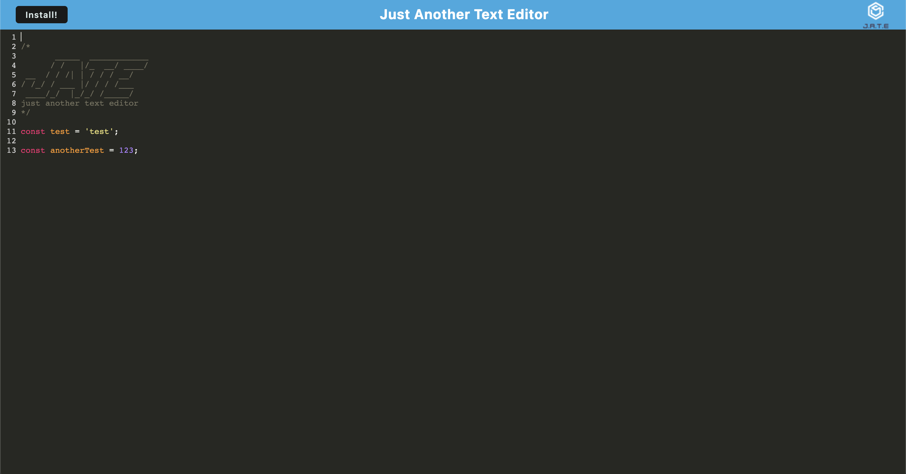

# J.A.T.E - Just Another Text Editor

  
   
   
  
  A simple text editing application that utilizes webpack to construct a progressive web application (PWA). The application also utilizes a service worker so that it can continue to function even when offline!

  [Deployed Application on Heroku](https://pwa-jate-nrmartin.herokuapp.com/)
   
   

  

  ##### Table of Contents  
  [How to Install](#installation)  
  [Usage](#usage)   
  [How to Contribute](#contribution)  
  [Contact](#contact)  
   

  

  ## How to Install
  Just click the Install button!
   
   

  

  ## Usage
  If you plan on contributing to the codebase, asked to be added as a collaborator, then clone the repo and start developing!
   
   

  

  ## How to Contribute
  Submit a pull request!
   
   

  

  ## Contact
  If you have any questions, contact the administrator at:

  * [n-r-martin](github.com/n-r-martin)
  * hello@nickmartin.design
  